# Documentación del Proyecto

Este proyecto es una plataforma web que permite gestionar rutinas de ejercicios, alimentación y entrenamientos personalizados. A continuación, se presentan capturas de pantalla que muestran la funcionalidad del sistema y su interfaz.

---

## 🌐 Sitio Web

### Página de Inicio
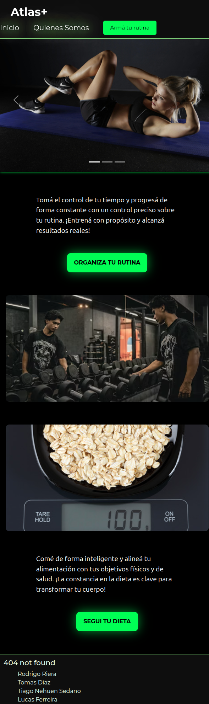

### ¿Quiénes Somos?
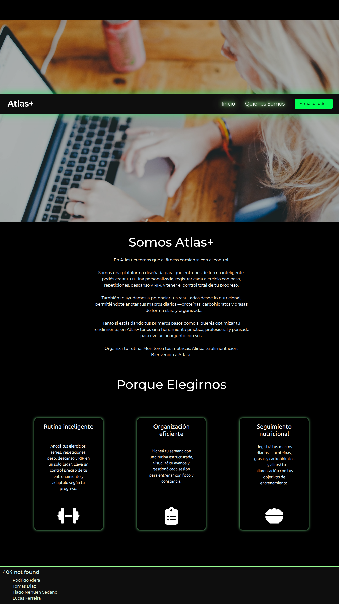

### Rutinas y Alimentación
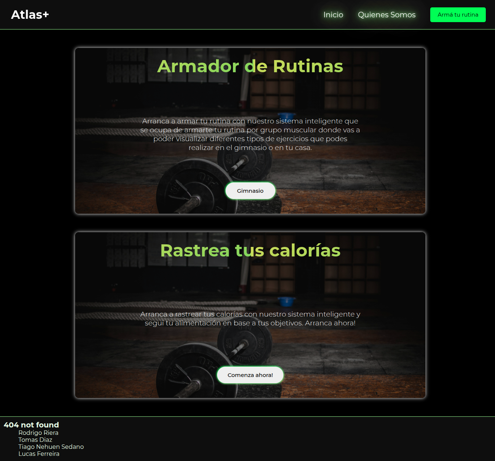

### Armá tu Rutina
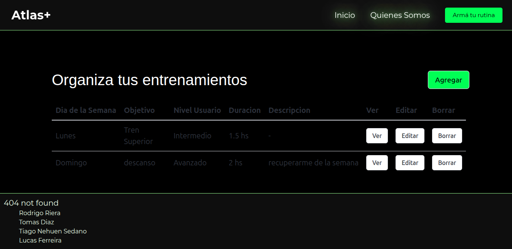

---

## 🥗 Alimentación

### Vista General
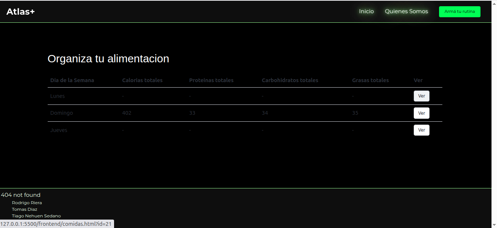

### Alta de Comida
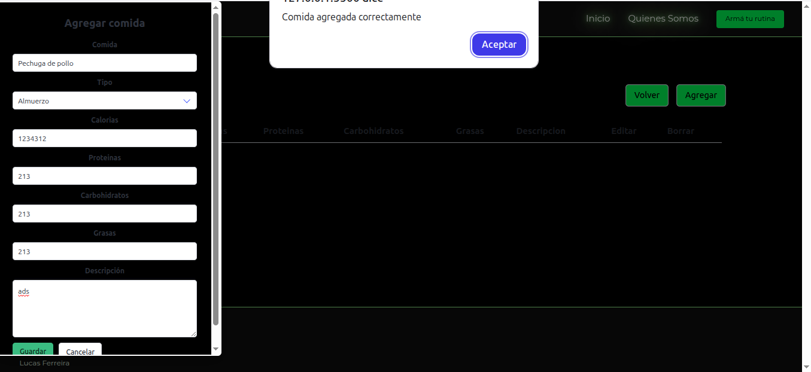

### Creación de Comida
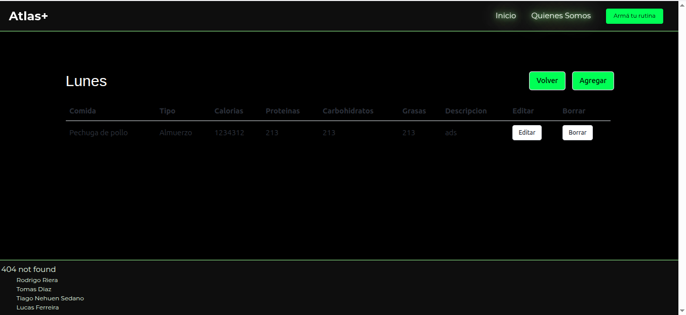

### Actualización de Comida
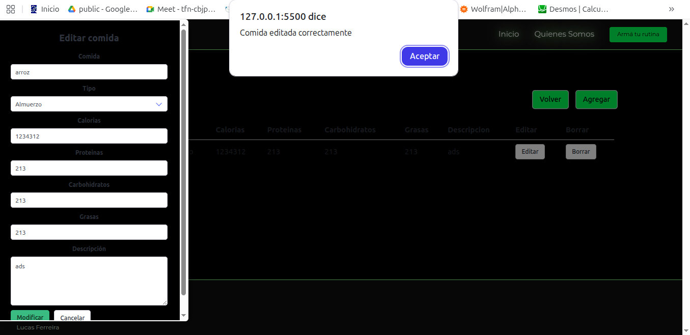

### Comida Actualizada
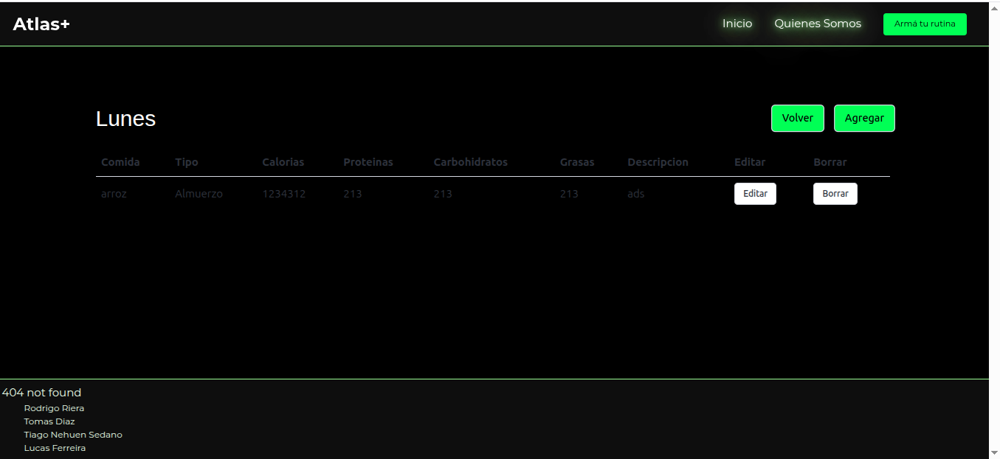

### Baja (Eliminar Comida)
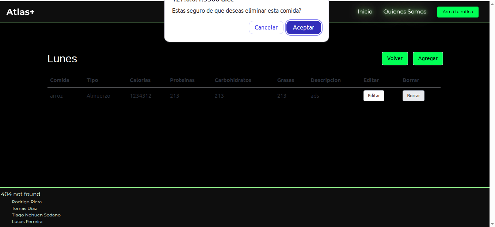

---

## 🏋️ Ejercicios

### Vista General

### Alta de Ejercicio
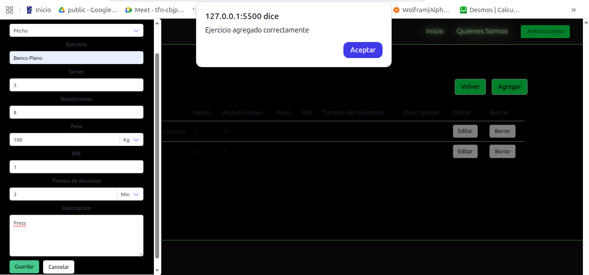

### Creación de Ejercicio
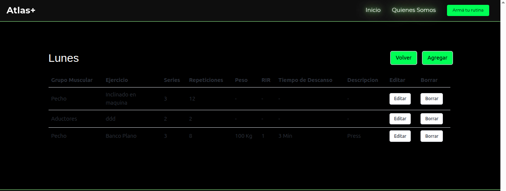

### Actualización de Ejercicio
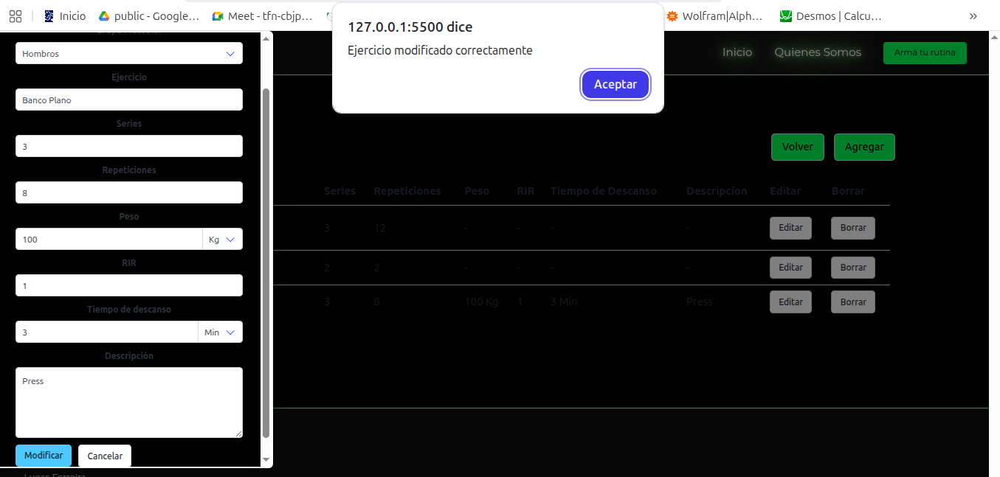

### Ejercicio Actualizado
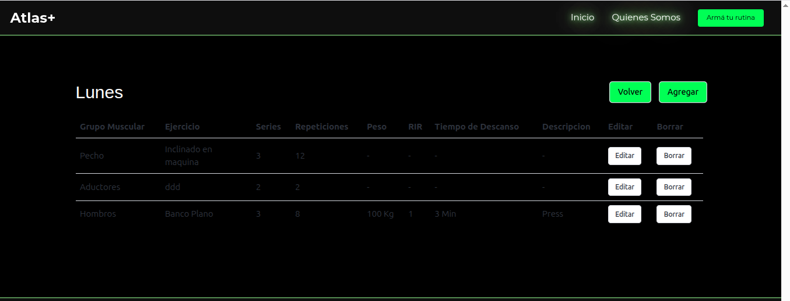

---

## 📅 Entrenamientos

### Vista General
_(No hay imagen general de entrenamientos)_

### Alta de Entrenamiento
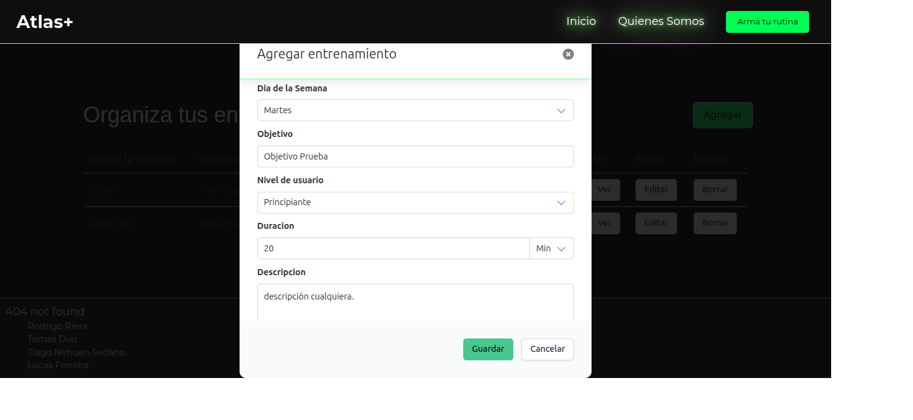

### Actualización de Entrenamiento
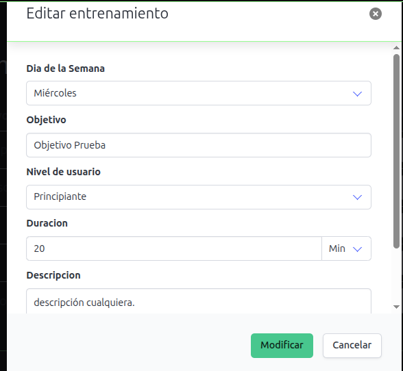

### Baja de Entrenamiento
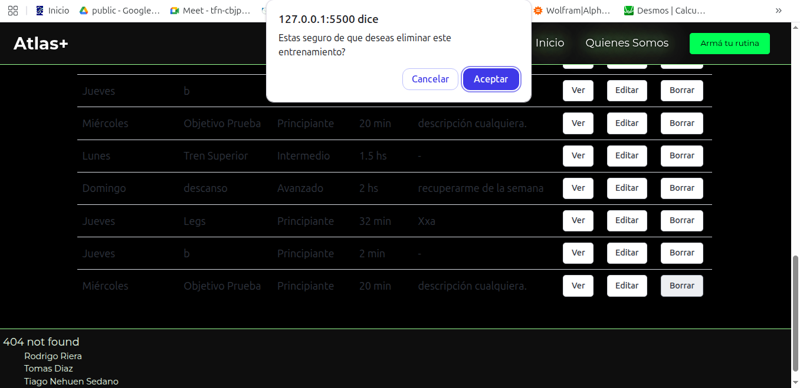

---